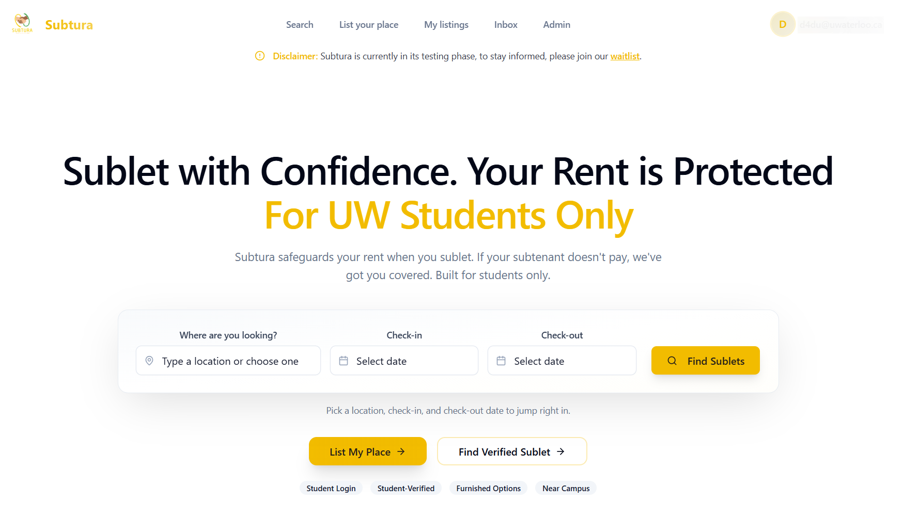
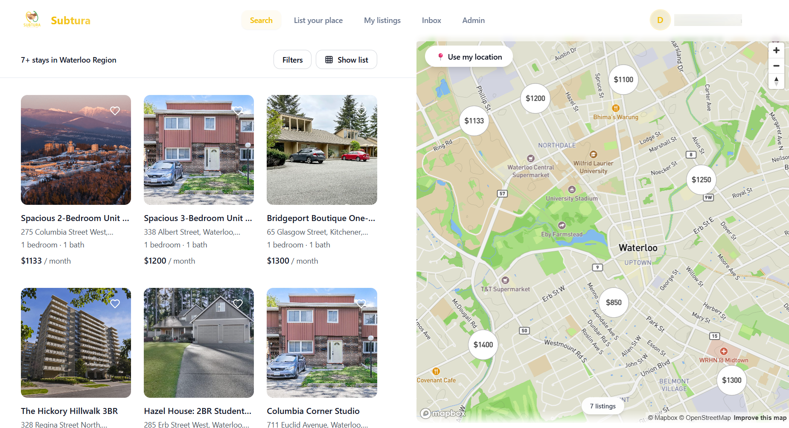
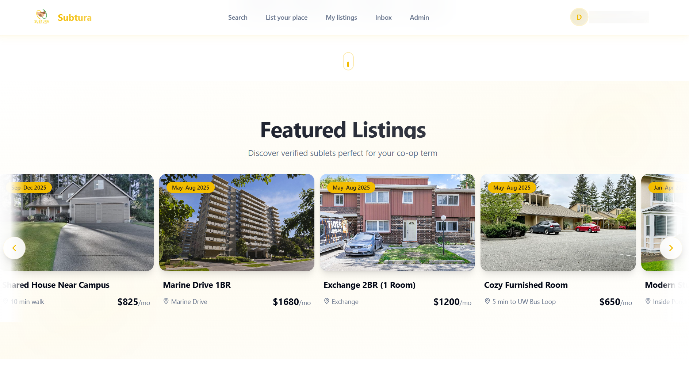
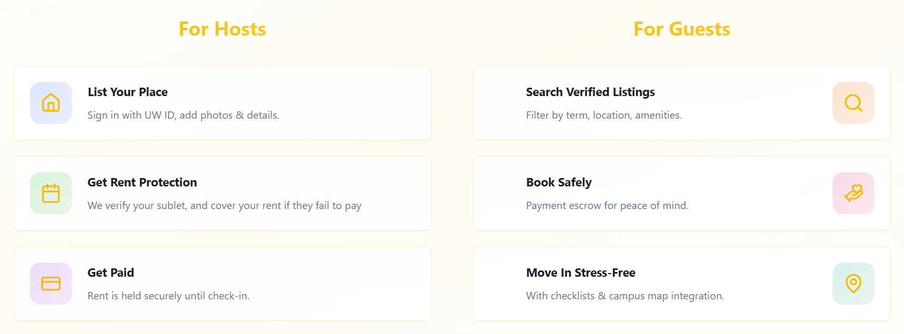
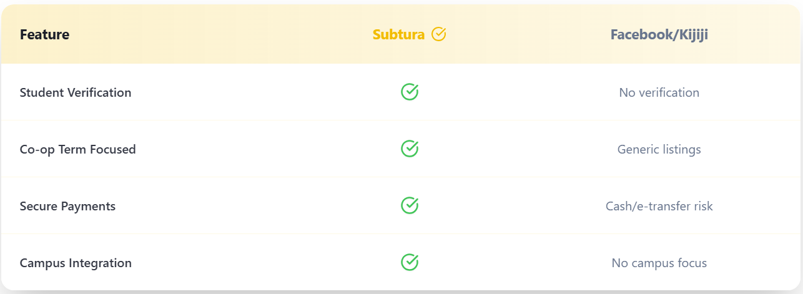
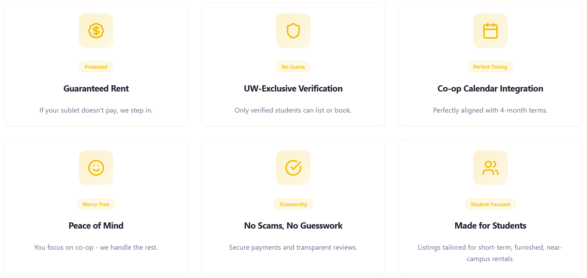

<!-- Product screenshots -->

  

  
  

---

<!-- Company Description -->

## Table of Contents

- [Overview](#overview)
- [Mission](#mission)
- [The Problem](#the-problem)
- [Our Approach](#our-approach)
- [Current Capabilities](#current-capabilities)
- [Product Roadmap](#product-roadmap)
- [Development Status](#development-status)
- [Contact](#contact)

---

## Overview

Subtura is a student-focused housing platform designed to make subletting safe, simple, and reliable. We provide a trusted marketplace exclusively for university students to find and list short-term housing that aligns with academic schedules.

## Mission

To help students find and offer sublets with confidence by building a trusted, student-only marketplace that reduces scams, stress, and uncertainty.

  

## The Problem

Student subletting presents significant challenges:

- High prevalence of scams and unreliable listings
- Fragmented and inefficient communication channels
- Time-consuming process of filtering low-quality posts
- Lack of transparency regarding authenticity and fair pricing
- Limited trust mechanisms between students

## Our Approach

- **Student-Only Access**: A closed community designed specifically for university students.
- **Trust-First Design**: Clear expectations, improved listing standards, and secure communication.
- **Academic Calendar Alignment**: Housing options that accommodate semester schedules and co-op terms.
- **Streamlined Experience**: Efficient browsing, straightforward posting, and simplified workflows.

  

## Current Capabilities

- Browse verified student sublet listings
- Advanced filtering by term dates, price range, and location
- Student account registration and verification
- Direct feedback channels to influence product development

  

## Product Roadmap

- Enhanced verification and trust indicators
- Comprehensive reporting and moderation systems
- Standardized listing requirements
- Guided workflows for both renters and subletters
- Optimized end-to-end experience for term-based housing

## Development Status

**Current Phase:** 🚧 Prototype / Early Rollout

We are actively gathering user feedback and iterating on the platform. Some features may be limited or subject to change as we refine the product based on real-world usage.

## Contact

**Email:** contact@subtura.com  
**Website:** subtura.com  
**Location:** Toronto, ON, Canada

---

© 2026 Subtura. Building the future of student housing.
